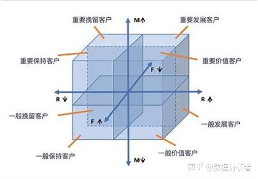

# CRM-客户关系管理

CRM, which stands for Customer Relationship Management, is a system used by businesses to manage interactions with both current and potential customers. It encompasses strategies, practices, and technologies aimed at improving customer relationships, enhancing satisfaction, and driving sales growth by centralizing and analyzing customer data. 

# RFM模型-客户分层

[MBA智库-案例分析](https://wiki.mbalib.com/wiki/RFM%E6%A8%A1%E5%9E%8B)

[数据分析 | 一文搞懂什么是RFM模型](https://zhuanlan.zhihu.com/p/432845221)

R 最近1次消费时间间隔（Recency）

F 消费频率（Frequency）

M 消费金额（Monetary）：一段时间内消费的总金额（“一段时间”通常根据不同应用场景来定）

而用这三个指标进行分析的方法就叫RFM模型或者是RFM分析法。

这个分析方法，在进行数据分析时通常我们将它用来客户群体划分上面。比如上面的场景中我们想要找到哪些客户属于“高价值”客户，哪些客户是“一般价值”客户，哪些又是“低价值“客户？这个时候我们就可以用这样三个指标来做评价的依据。以此来对客户进行“分层”。

那么，相信很明显，三个指标中

第一个指标R一定是越低越好。

例如，翔宇开了一个店铺，今天是31号，我要根据这个月的销售情况读客户分群，找到不同“层次”的客户。而张三是店里的常客，他这个月最后一次在翔宇的店里消费是29号，那么距离31号是2天，这个时候，我们就说R等于2，于是我们肯定是认为R越小，客户价值越高。

第二个指标是消费频率F，F一定是越高越好了，这个就更简单了吧，就比如还是上面的例子，这个月张三总共来了翔宇的店里消费了5次，那么F就是5，我们希望F越大越好

第三个是消费金额M，这个就更明显了，我就不解释了啊，M一定是越大客户越有价值。

知道这三个指标后，RFM模型是根据这三个指标得到一个三维的空间（立体坐标系），然后将客户根据各自三个指标的值映射到8个象限中，根据查看客户所在象限确定其价值程度。如下图。
