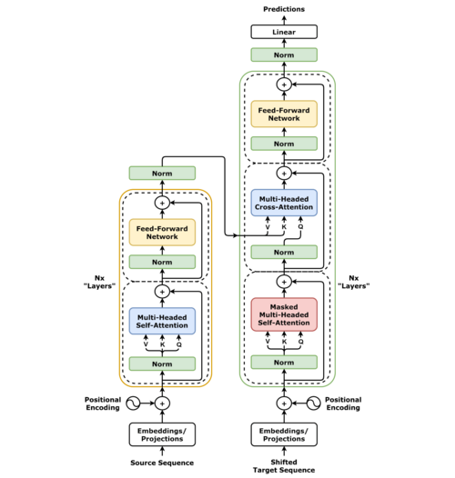

transformer（直译为“变换器”）是一种采用注意力机制的深度学习架构，这一机制可以按输入数据各部分重要性的不同而分配不同的权重。采用该架构的模型主要用于自然语言处理（NLP）与电脑视觉（CV）领域。

transformer架构图，左边为编码器，右边为解码器。注：图中采用前向层归一化，与原2017年原论文采用后向层归一化不同

与循环神经网络（RNN）一样，transformer旨在处理自然语言等顺序输入数据，可应用于翻译、文本摘要等任务。而与RNN不同的是，transformer能够一次性处理所有输入数据。注意力机制可以为输入序列中的任意位置提供上下文。如果输入数据是自然语言，则transformer不必像RNN一样一次只处理一个单词，这种架构允许更多的并行计算，并以此减少训练时间。

transformer于2017年由谷歌大脑的一个团队推出[2]，现已逐步取代长短期记忆（LSTM）等RNN模型成为了NLP问题的首选模型。[3]并行化优势允许其在更大的数据集上进行训练。这也促成了BERT、GPT等预训练模型的发展。[4][5] 这些系统使用了维基百科、Common Crawl等大型语料库进行训练，并可以针对特定任务进行微调。